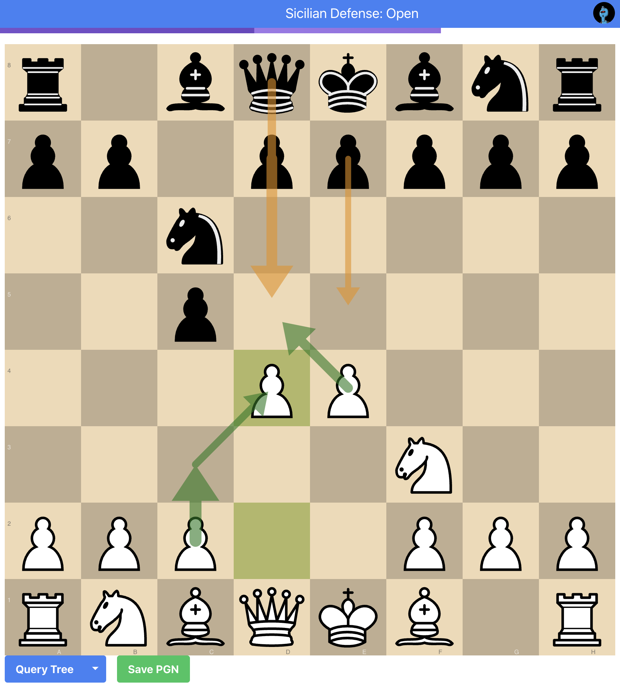
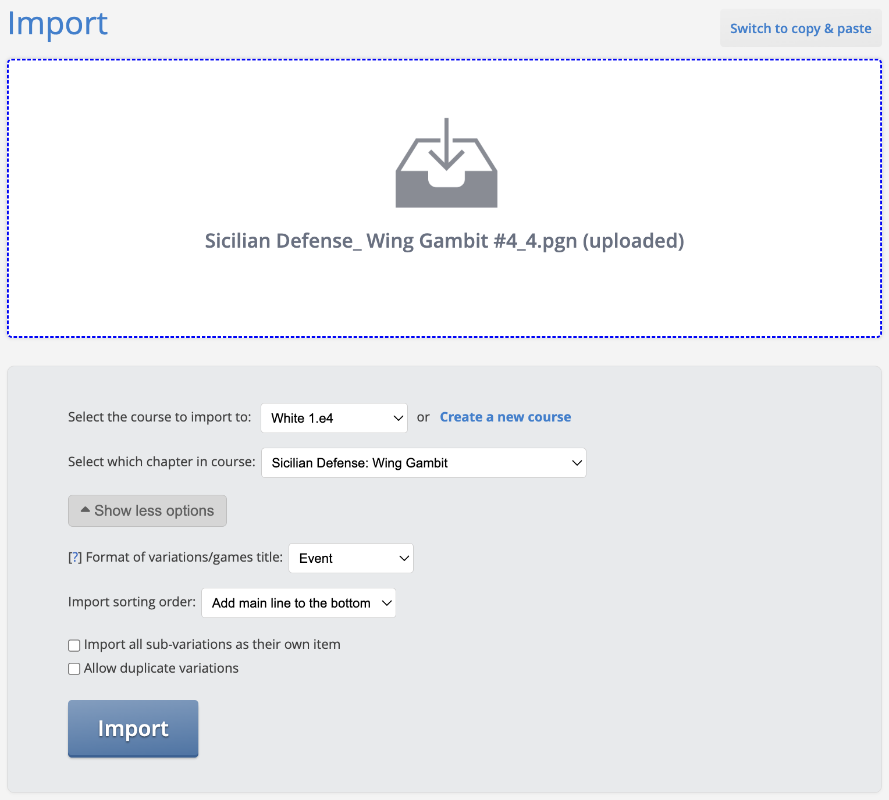

# Chancellor: chess opening repertoire builder



Chancellor is a chess opening repertoire builder that assists in creating an opening repertoire for chess players to
practice and improve their game. The application provides an interface for searching and evaluating chess moves in
specific openings and allows the generation of PGN files that can be uploaded to training platforms like chessable.com.

## Objective

The application aims to build an optimized opening repertoire for you based on the Lichess database, allowing you to
focus on lines where your opponents are more likely to make mistakes. This is done through a weighted average
probability to win from a given position, giving you a repertoire not just based on theoretically sound moves but on
practical pitfalls as well.

## Features

- Browse and evaluate different chess openings.
- Generate PGN files for training.
- Optimizes your repertoire based on practical play, not just theoretical soundness.

## Setup

### Run locally

To run the application locally, use one of the following commands:

```bash
npm run start:development:local
```

or

```bash
npm run start:production:local
```

### Chess engine setup

The best way to create a robust and accurate repertoire is to set up both the Lichess database and a local chess engine
like Stockfish.

#### Lichess database

You can download and set up the Lichess openings database locally from
[here](https://github.com/lichess-org/lila-openingexplorer).

It is recommended to reduce the number of plies to ~30 to reduce the size of the database. This can be done by changing
```rs
const MAX_PLIES: usize = 30;
```
This way you can save your disk space and reduce the time it takes to upload files from 
[database.lichess.org](https://database.lichess.org/) into the database.

#### Stockfish engine

To run Stockfish locally:

```bash
cd stockfish
npm install
npm start # Optionally pass time to think in milliseconds
```

## How to generate PGN files

1. Use the UI to browse through openings and evaluate moves.
2. Generate a PGN file based on your selected repertoire.
3. Import the generated PGN file to Chessable.



Note: While importing to Chessable, set the `Format of variations/games title` to the Event field of the PGN and disable
the `Import all sub-variations as their own item` option.

## Limitations

- The application uses the Lichess database, which has request limitations. As such, excessive querying may result in
  temporary bans. The app is demo-ready but not production-ready in this state.
- For evaluation purposes, the app uses pre-calculated evaluations from Lichess
  [Cloud Eval API](https://lichess.org/api#tag/Analysis). These are good for demos but not recommended for production
  use.

## Documentation

- [Lichess API Documentation](https://lichess.org/api)

## Live demo

Check out the live demo [here](https://bonkin.github.io/chancellor/).

## Dependencies

The application relies on several key libraries for functionality and UI:

### Core libraries:

- React: UI Library
- TypeScript: Static typing for JavaScript

### UI libraries:

- @headlessui/react: A UI framework for React
- @heroicons/react: A set of SVG icons for React

### Chess specific:

- chess.js: Chess rules engine
- chessground: Awesome interactive chess board from lichess.org

### Networking and OAuth:

- @bity/oauth2-auth-code-pkce: OAuth2 with PKCE support

### File operations:

- file-saver: File saving utility

## License

MIT

## Contributing

Contributions, issues, and feature requests are welcome. Feel free to check the issues page.

Happy Chess Playing!
